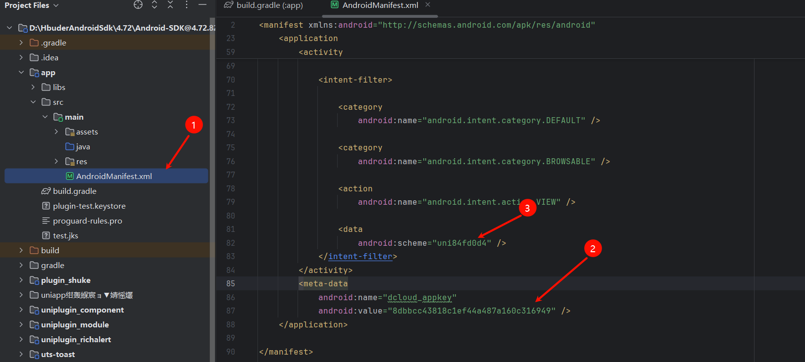

# uniapp Android 原生插件教程 
此插件基于 [原文](https://blog.csdn.net/Douz_lungfish/article/details/126270135) 进行编写

uniapp配套项目，可打包自定义基座后直接运行 ===> [点我](https://github.com/shuke-zhang/uniapp-plugin-test)

## 下载原生插件SDK ---> [点击跳转](https://nativesupport.dcloud.net.cn/AppDocs/usesdk/android.html)

 -  下载解压之后如图所示，后续我们将使用 **UniPlugin-Hello-AS** 文件夹来进行插件的编写
   

## 项目导入
 - 打开 Android Studio 按照以下步骤操作（需提前准备好Android Studio环境）
 - 选择 **UniPlugin-Hello-AS** 项目，点击OK后完成导入 


## 插件开发
#### 新建Module
- 先选择左侧的 **Android Library** 填写右侧信息  
  - Module name → 模块名称
  - Package name → 默认为 `com.example.mylibrary`
  - Language → 编程语言 `可以选 Java 或 Kotlin，这里选的是 Java`
  - Minimum SDK → 最低支持的 SDK 版本 `最低支持安卓5.0`
  - Build Configuration Language → 构建配置语言
- 填写完成后点击 finish 后会在项目根目录创建一个Module name 的文件夹，此时创建成功。

#### 文件配置
- 打开文件时请先将试图模式切换为 **Project**
  
- build.gradle文件配置 文件中添加以下代码
  ```js
  repositories {
    flatDir {
        dirs 'libs'
     }
    }

    dependencies {

        compileOnly 'androidx.recyclerview:recyclerview:1.0.0'
        compileOnly 'androidx.legacy:legacy-support-v4:1.0.0'
        compileOnly 'androidx.appcompat:appcompat:1.0.0'
        compileOnly 'com.alibaba:fastjson:1.1.46.android'

        compileOnly fileTree(include: ['uniapp-v8-release.aar'], dir: '../app/libs')

    }
  ```
 - dependencies 中代码请放置在原有代码下方，然后点击 **Sync Now** 同步。具体配置见下图


#### 配置混淆文件
  - 打开Module根目录下（即plugin_shuke\proguard-rules.pro）的proguard-rules.pro文件，在最后一行末尾加入以下代码
  ```js
  -keep public class * extends io.dcloud.feature.uniapp.common.UniModule{*;}
  ```
  

#### 创建Module类
- 清先将试图模式换成 **Project Files** 方便查看文件层级。 按照以下路径创建新类 ===> plugin_shuke\src\main\java\com\example\plugin_shuke

- 输入class名字后按下enter键即可创建


#### 继承UniModule 类 
- uniapp的Module扩展必须继承UniModule类
```java
package com.example.plugin_shuke;

import io.dcloud.feature.uniapp.common.UniModule;

public class test extends UniModule{

}
```

#### 功能开发
 - UniJSCallback是 DCloud UniApp 插件 SDK 提供的一个回调。接口让 原生插件（Java/Android 端） 可以把结果返回给 前端 JS。
 - callback.invoke(...)是 UniJSCallback 的方法。用来 触发回调，把数据返回给 JS 调用者。
 - 完整源码
```java
package com.example.plugin_shuke;

import com.alibaba.fastjson.JSONObject;

import io.dcloud.feature.uniapp.bridge.UniJSCallback;
import io.dcloud.feature.uniapp.common.UniModule;
import io.dcloud.feature.uniapp.annotation.UniJSMethod;


public class test extends UniModule {

    /**
     * 向前端暴露的方法：传入一个名字，返回“你好！xxx”
     *
     * @param name     前端传入的字符串参数（如：舒克）
     * @param callback 用于向前端回调结果
     */
    @UniJSMethod(uiThread = true)
    public void sayHello(String name, UniJSCallback callback) {
        if (callback != null) {
            // 构造返回的数据
            JSONObject data = new JSONObject();
            data.put("reply", "你好！" + name);

            // 通过回调返回给前端
            callback.invoke(data);
        }
    }
}
```
- 至此一个简单的插件已经开发完成
  
## 插件调试
#### 创建Appid 、 创建uniapp新项目
 - 获取AppId 登录 dcloud 开发者中心 ---> [点击跳转](https://dev.dcloud.net.cn/)
 - 登录成功之后创建应用
  
 - 填写相关信息
  
 - 创建成功之后就可以查看到对应的 **Appid**
  
 - 打开CMD通过cli创建项目 `npx degit dcloudio/uni-preset-vue#vite-ts plugin-test` 也可以[点击跳转](https://uniapp.dcloud.net.cn/quickstart-cli.html#%E5%88%9B%E5%BB%BAuni-app)通过其他方式创建 
 - 项目创建成功之后将 **Appid** 放到src下的manifest.json文件中 `"name" : "plugin-test", "appid" : "__UNI__84FD0D4"`
 - 也可以通过 HBuilder X 中直接填写


#### 证书申请
 ###### 云端证书申请
 - 在上述 dcloud 开发者中心我的应用中点击应用名称

 - 点击创建后等待一段时间刷新后即可创建证书成功

 - 证书生成成功之后点击下载然后放置在app目录下
 
  ###### 证书配置
 - 点击证书详情可以查看证书相关信息，将信息依次填入文件中的signingConfigs.config配置项，然后点击右上角同步完成配置
   - keyAlias 证书别名
   - keyPassword 证书密码
   - storeFile file 证书文件地址
   - storePassword 证书文件密码
   - v1SigningEnabled v2SigningEnabled 启用 V1 签名（适用于 Android 7.0 及以下）
 
 

#### 插件配置
###### 注册插件
 - 打开文件app\src\main\assets\dcloud_uniplugins.json，在nativePlugins配置中填写。那么也要填写，后续使用将以name来使用


###### 引入插件
 - 在app\build.gradle中添加以下代码,project名称就是刚刚注册插件的name。填写完成后点击右上角 Sync Now 同步


## 离线打包
###### 获取离线key
 - 在项目app目录下的build.gradle文件中获取安卓包名 

 - 回到 dcloud 开发者中心

 - 在证书详情中获取信息一次填写

 - 新增完成后创建离线key，之后即可查看离线key


###### 配置离线key
 - 将刚刚创建的离线key填写到 app\src\main\AndroidManifest.xml 中，并且android:scheme 可以用appid的小写，以便于解决报错（该报错似乎不影响运行）


###### 生成本地打包资源
 - 编写页面 以下代码可直接复制粘贴 - requireNativePlugin中的插件名为dcloud_uniplugins注册插件时的name
  
```vue
  <script setup lang="ts">
  import { ref } from "vue"

  // 输入的名字
  const name = ref("")
  // 插件回调结果
  const reply = ref("")

  // 调用插件方法
  function callPlugin() {
    if (!name.value) {
      reply.value = "请输入名字"
      return
    }

    // @ts-ignore 因为 uni 对象是全局的
    uni.requireNativePlugin("plugin_shuke")
      .sayHello(name.value, (res: any) => {
        // 插件返回数据
        reply.value = res.reply
      })
  }
  </script>

  <template>
    <div class="container">
      <h2>插件调用示例</h2>
        <input
          v-model="name"
          type="text"
          placeholder="请输入名字"
          class="input"
        />
      <button @click="callPlugin" class="btn">调用插件</button>
      <p  class="reply">插件返回：{{ reply || '-' }}</p>
    </div>
  </template>

  <style scoped>
  .container {
    display: flex;
    flex-direction: column;
    align-items: center;
    margin-top: 50px;
  }

  .input {
    padding: 8px;
    font-size: 16px;
    margin: 10px 0;
    width: 200px;
    border-radius: 6px;
    border: 1px solid #ccc;
  }

  .btn {
    padding: 8px 16px;
    font-size: 16px;
    background: #42b883;
    color: white;
    border: none;
    border-radius: 6px;
    cursor: pointer;
  }

  .btn:hover {
    background: #36a572;
  }

  .reply {
    margin-top: 20px;
    font-size: 18px;
    color: #333;
  }
  </style>
```

- 打开HBuilder X 

 - 打包成功控制台会出现资源目录，打开改后复制 **__UNI__84FD0D4** 整个项目文件放置到 app\src\main\assets\apps

 - 配置uniapp的appid，在插件项目下打开app\src\main\assets\data\dcloud_control.并按照下图填写


#### 运行调试
 - 使用use连接电脑后直接点击运行

 - 如果出现以下调试信息，那么恭喜你插件成功了


## uniapp项目引入插件

###### SDK版本
  - 为了避免打包时编译出错，我们需要将插件项目和uniapp项目的sdk都统一一下


###### Android Studio配置
 - 在正式打包之前，如果你使用的是新版本会造成Gradle没有assembleRelease等选项。先按照以下步骤配置。
  
  
  
 - 双击图示位置即可开始编译 assembleRelease

 - 当看到一下内容时说明编译成功了


###### uniapp项目使用插件
 - 在项目根目录中新建以下文件 **plugin_shuke.aar** 为刚刚编译出来的文件

 - 在package.json中写入以下内容，具体配置可参考[官方文档](https://nativesupport.dcloud.net.cn/NativePlugin/course/package.html#package-json)

```json
  {
      "name": "plugin_shuke",
      "id": "plugin_shuke",
      "version": "1.0.0",
      "description": "我自己的插件",
      "_dp_type":"nativeplugin",
      "_dp_nativeplugin":{
          "android": {
              "plugins": [
                  {
                      "type": "module",
                      "name": "plugin_shuke",
                      "class": "com.example.plugin_shuke.test"
                  }
              ],
        "integrateType": "aar",
              "parameters": {
                  
              },
              "dependencies": []
          }
      }
  }
```
###### 引入插件
 - 打开HBuilder并打开项目文件的manifest.json,选择好本地插件即可


###### 打包自定义基座


 - 当控制台出现以下打包信息提示时则表示自定义基座打包成


###### 项目运行
 - 按照以下步骤运行，


 - 如果出现以下内容，则表示插件引入成功


## 至此一个简单的安卓原生插件就开发完毕了
